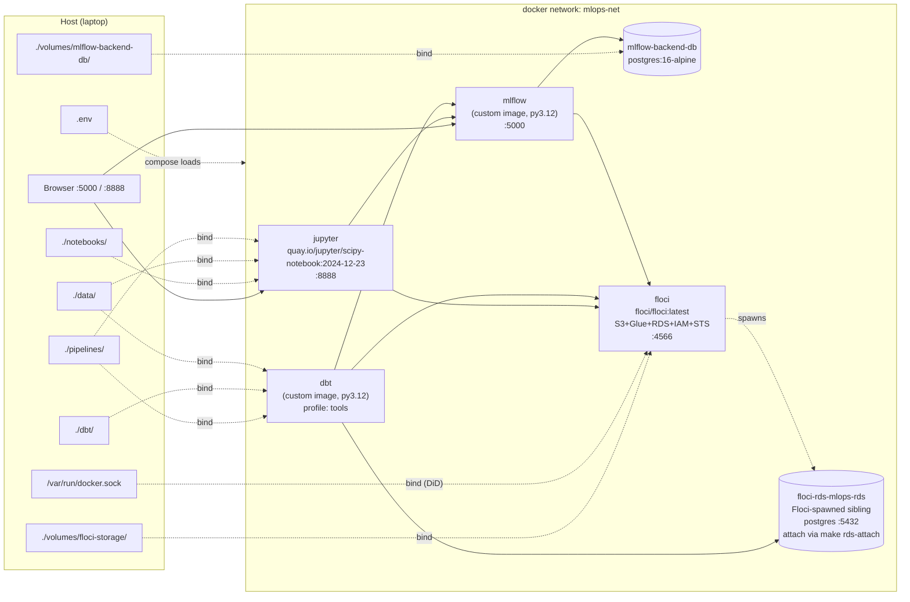
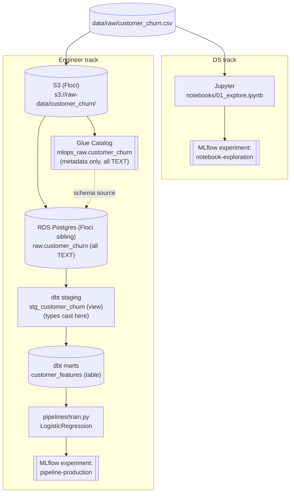

# mlops-local-template

データサイエンティスト / データエンジニアの小規模ペアを想定した、**完全ローカル完結の MLOps テンプレート**です。Jupyter、MLflow、S3+Glue+RDS エミュレータ（Floci、LocalStack 互換）、dbt ランナーをまとめて Docker でノート PC 上に立ち上げます。SaaS もクラウドアカウントも不要です。同梱のサンプルユースケースは **Telco 顧客離反予測**で、DS は同じ生 CSV を Notebook で探索しつつ、エンジニアトラックは S3 → Glue → RDS → dbt → MLflow に登録された分類器へと昇格させます。

- **DS 向け**: Jupyter を開き、`data/raw/customer_churn.csv` を読み込み、Experiment `notebook-exploration` に MLflow ロギング。
- **エンジニア向け**: `make seed → make load-rds → make dbt-run → make train` で Experiment `pipeline-production` にモデルを記録。
- **MLflow サーバは両トラック共通** — Experiment 名で区別します。

関連: [docs/architecture.md](docs/architecture.md)（設計判断）と [docs/troubleshooting.md](docs/troubleshooting.md)（頻出エラー対応）。

---

## 5 分で立ち上げる

前提: Docker（Compose v2 含む）、GNU Make、Terraform `>= 1.5`。WSL2 ユーザーは [troubleshooting.md](docs/troubleshooting.md) を参照してください。

```bash
# 1. 設定
cp .env.example .env                                       # 必要に応じてポートやトークンを変更

# 2. デフォルトスタックを起動（jupyter, mlflow, mlflow-backend-db, floci）
make up

# 3. Floci エミュレートの AWS リソース作成（S3 バケット + RDS Postgres）
cd infra/terraform && terraform init && terraform apply -auto-approve && cd ../..

# 4. Floci が spawn した RDS コンテナを mlops-net に接続し、
#    Glue カタログ DB と customer_churn テーブルを作成（Terraform ではなく boto3）。
make rds-attach
make glue-setup

# 5. エンジニアパイプライン: CSV -> S3 -> Glue -> RDS -> dbt -> MLflow で学習済みモデル
make seed                # data/raw/customer_churn.csv を s3://raw-data/ にアップロード
make load-rds            # Glue カタログを参照 -> raw.customer_churn にロード
make dbt-run             # staging.stg_customer_churn (view) + marts.customer_features (table)
make dbt-test            # 10 件のテスト
make train               # train.py -> MLflow の "pipeline-production" Experiment

# 6. UI を開く
#    MLflow:  http://localhost:5000   （Experiment: notebook-exploration, pipeline-production）
#    Jupyter: http://localhost:8888   （token は .env の JUPYTER_TOKEN、デフォルト "mlops"）
```

`make generate-data` は任意です。7,000 行のサンプル CSV は `data/raw/customer_churn.csv` に既にコミット済みです。乱数を引き直したい場合だけ実行してください。

便利な運用コマンド:

```bash
make help        # 全 target 一覧
make ps          # 全サービスのステータス
make logs        # 全コンテナのログを tail
make down        # スタック停止（ボリュームは保持）
make nuke        # スタック停止 + Docker 管理ボリューム削除
make tf-destroy  # Floci 側 AWS リソースの破棄
```

---

## システム構成

デフォルトでは 1 つの Docker ブリッジネットワーク (`mlops-net`) 上で 4 コンテナが動作し、加えて Floci が `terraform apply` のタイミングで spawn する兄弟 Postgres コンテナが "RDS" の実体となります。`dbt` サービスは 5 つ目のコンテナで、Compose の `tools` プロファイル下に置かれ、Python や dbt が必要な `make` target からオンデマンド起動されます。永続状態はすべてホストの `./volumes/` 配下にバインドマウントして可視化しています。



---

## データフロー

2 つのトラックが同じ生 CSV と同じ MLflow サーバを共有し、Experiment 名のみで分離しています。



---

## エンジニアフローのシーケンス

`make up` + `terraform apply` のあと、エンジニア側 `make` targets を順に叩いたときに発生する処理。

```mermaid
sequenceDiagram
    actor User
    participant Make
    participant S3 as S3 (Floci)
    participant Glue as Glue (Floci)
    participant RDS as RDS Postgres (Floci sibling)
    participant dbt as dbt
    participant Train as train.py
    participant MLflow

    User->>Make: make rds-attach
    Make->>RDS: docker network connect mlops-net floci-rds-mlops-rds

    User->>Make: make glue-setup
    Make->>Glue: CreateDatabase(mlops_raw)
    Make->>Glue: CreateTable(customer_churn, columns=string[21])

    User->>Make: make seed
    Make->>S3: PutObject customer_churn/customer_churn.csv

    User->>Make: make load-rds
    Make->>Glue: GetTable(mlops_raw, customer_churn)
    Glue-->>Make: columns + S3 location
    Make->>S3: GetObject (CSV bytes)
    Make->>RDS: CREATE SCHEMA raw; replace raw.customer_churn (TEXT cols)

    User->>Make: make dbt-run
    Make->>dbt: dbt run
    dbt->>RDS: build view  staging.stg_customer_churn
    dbt->>RDS: build table marts.customer_features

    User->>Make: make dbt-test
    Make->>dbt: dbt test
    dbt->>RDS: not_null / unique / accepted_values (10 tests)

    User->>Make: make train
    Make->>Train: python pipelines/train.py
    Train->>RDS: SELECT * FROM marts.customer_features
    Train->>MLflow: start_run(experiment="pipeline-production")
    Train->>MLflow: log_params, log_metrics, log_model
    MLflow->>S3: PUT model artifacts (bucket: mlflow-artifacts)
```

---

## ディレクトリ構成

```
mlops-local-template/
|-- Makefile                # 全 target は `make help`
|-- docker-compose.yml      # mlops-net ブリッジネットワーク上の 5 サービス
|-- .env.example            # コピーして .env を作成
|-- data/                   # raw/ と processed/ の CSV（バインドマウント）
|-- notebooks/              # Jupyter ノートブック（DS トラック）
|-- pipelines/              # seed_s3.py, setup_glue.py, load_s3_to_rds.py, train.py
|-- scripts/                # generate_sample_data.py
|-- dbt/                    # dbt プロジェクト、staging + marts モデル
|-- mlflow/                 # MLflow サーバの Dockerfile と requirements
|-- infra/
|   |-- terraform/          # S3 + RDS on Floci（Glue はここに無い -- architecture.md 参照）
|   `-- floci/init/         # Floci 起動時フック
|-- volumes/                # バインドマウントの永続状態（gitignore 済み）
`-- docs/                   # architecture.md, troubleshooting.md
```

---

## ピン留めバージョン

下表の値はすべてソースファイルから取得しています。どれかをアップグレードする場合は、この表とソースファイルの両方を更新してください。

| コンポーネント | バージョン | ソース |
| --- | --- | --- |
| Python（全イメージ） | `3.12-slim` | `mlflow/Dockerfile`, `dbt/Dockerfile` |
| MLflow | `mlflow==3.12.0` | `mlflow/requirements.txt`, `dbt/requirements.txt` |
| boto3 | `1.43.6` | `mlflow/requirements.txt`, `dbt/requirements.txt` |
| psycopg2-binary | `2.9.12` | `mlflow/requirements.txt`, `dbt/requirements.txt` |
| dbt-postgres | `1.10.0`（推移的に dbt-core `1.11.9` を取得） | `dbt/requirements.txt` |
| pandas | `2.3.3` | `dbt/requirements.txt` |
| SQLAlchemy | `2.0.44` | `dbt/requirements.txt` |
| scikit-learn | `1.7.2` | `dbt/requirements.txt` |
| Postgres（MLflow DB） | `postgres:16-alpine` | `docker-compose.yml` |
| Postgres（Floci RDS） | エンジン `postgres 16`（Floci が spawn） | `infra/terraform/rds.tf` |
| Terraform | core `>= 1.5.0`、AWS provider `~> 5.70` | `infra/terraform/versions.tf` |
| Floci | `floci/floci:latest` | `docker-compose.yml` |
| Jupyter | `quay.io/jupyter/scipy-notebook:2024-12-23` | `docker-compose.yml` |

---

## 次に読むべき場所

- [docs/architecture.md](docs/architecture.md) — このスタック構成にした理由（MLflow 1 台 / Postgres 2 台 / Terraform 外の Glue / dbt-postgres / Floci RDS の Docker-in-Docker / バインドマウント / スコープ外項目）。
- [docs/troubleshooting.md](docs/troubleshooting.md) — 実際に遭遇するエラーの 症状 → 原因 → 対処（Floci のポート衝突、RDS 未接続、Glue GetTags、WSL2 権限、`dbt run --full-refresh` 等）。
- [infra/terraform/README.md](infra/terraform/README.md) — Terraform の使い方と Glue を Terraform 外に出した判断。
- [pipelines/README.md](pipelines/README.md) — 各パイプラインスクリプトの入出力。
