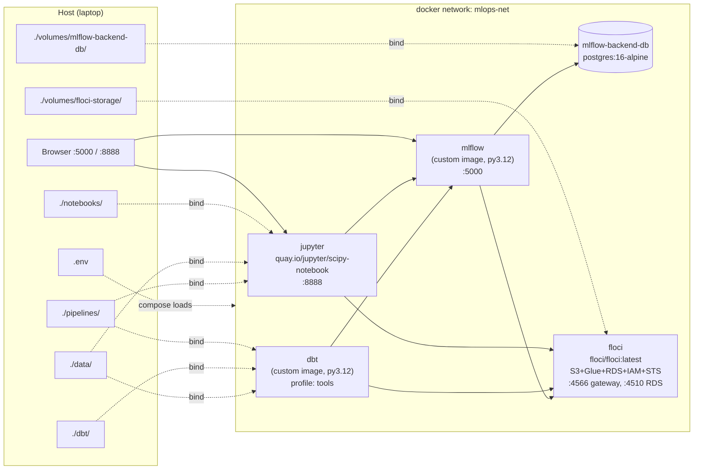
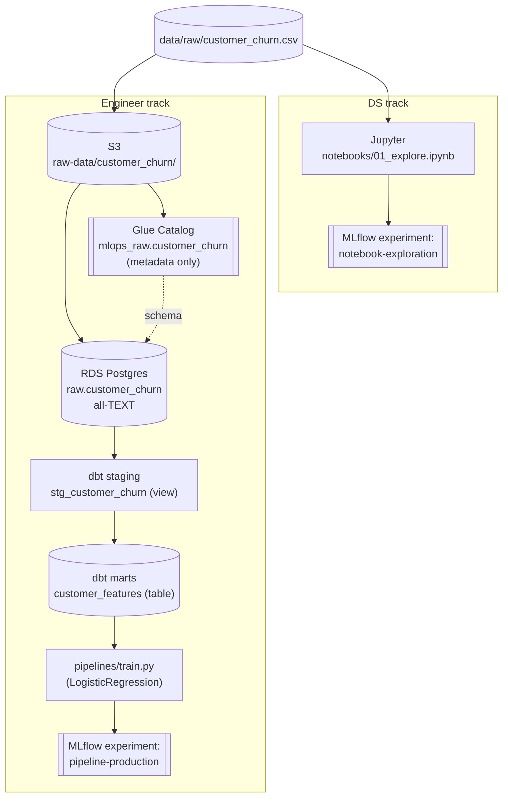

# mlops-local-template

A **fully local MLOps template** for a small data-science / data-engineer pair. The whole stack — Jupyter, MLflow, an S3+Glue+RDS emulator (Floci/LocalStack-compatible), and a dbt runner — runs in Docker on a laptop, with no SaaS or cloud account required. The bundled sample use case is **Telco customer churn**: data scientists explore the raw CSV in a notebook while the engineer track promotes the same CSV through S3 → Glue → RDS → dbt → an MLflow-tracked classifier.

- **For DS**: open Jupyter, read `data/raw/customer_churn.csv`, log experiments to MLflow under `notebook-exploration`.
- **For engineers**: `make seed → make load-rds → make dbt-run → make train` produces a model in MLflow under `pipeline-production`.
- **Same MLflow server** for both tracks — segregation is by experiment name.

See also: [docs/architecture.md](docs/architecture.md) (design decisions) and [docs/troubleshooting.md](docs/troubleshooting.md) (common errors).

---

## 5-minute quickstart

Prerequisites: Docker (with Compose v2), GNU Make, Terraform >= 1.5. WSL2 users see [troubleshooting.md](docs/troubleshooting.md).

```bash
# 1. Configure
cp .env.example .env                 # tweak ports / tokens if needed

# 2. Bring the stack up (jupyter, mlflow, mlflow-backend-db, floci)
make up

# 3. Provision Floci-emulated AWS (S3 buckets, Glue DB+table, RDS Postgres)
make tf-init
make tf-apply

# 4. Generate the sample CSV (skip if data/raw/customer_churn.csv already exists)
make generate-data

# 5. Engineer pipeline: CSV -> S3 -> RDS -> dbt -> trained model in MLflow
make seed
make load-rds
make dbt-run
make dbt-test
make train

# 6. Open the UIs
#    MLflow:  http://localhost:5000          (experiments: notebook-exploration, pipeline-production)
#    Jupyter: http://localhost:8888          (token = JUPYTER_TOKEN from .env, default "mlops")
```

Useful housekeeping:

```bash
make ps          # status of all services
make logs        # tail logs from every container
make down        # stop stack (keeps volumes)
make nuke        # stop stack and remove docker-managed volumes
make tf-destroy  # tear down Floci-side AWS resources
```

Run `make help` for the full list.

---

## System architecture

Five containers on a single Docker bridge network, all bind-mounted to host directories under `./volumes/` for transparency.



---

## Data flow

Two parallel tracks share the same raw CSV and the same MLflow server, separated only by experiment name.



---

## Engineer-flow sequence

What happens, in order, when you run the five engineer-side `make` targets.

```mermaid
sequenceDiagram
    actor User
    participant Make
    participant S3 as S3 (Floci)
    participant Glue as Glue (Floci)
    participant RDS as RDS Postgres (Floci :4510)
    participant dbt as dbt
    participant Train as train.py
    participant MLflow

    User->>Make: make seed
    Make->>S3: PutObject customer_churn/customer_churn.csv

    User->>Make: make load-rds
    Make->>Glue: GetTable(mlops_raw, customer_churn)
    Glue-->>Make: columns + S3 location
    Make->>S3: GetObject (CSV bytes)
    Make->>RDS: CREATE SCHEMA raw; replace raw.customer_churn (TEXT cols)

    User->>Make: make dbt-run
    Make->>dbt: dbt run
    dbt->>RDS: build view  staging.stg_customer_churn
    dbt->>RDS: build table marts.customer_features

    User->>Make: make dbt-test
    Make->>dbt: dbt test
    dbt->>RDS: not_null / unique / accepted_values

    User->>Make: make train
    Make->>Train: python pipelines/train.py
    Train->>RDS: SELECT * FROM marts.customer_features
    Train->>MLflow: start_run(experiment=pipeline-production)
    Train->>MLflow: log_params, log_metrics, log_model
    MLflow->>S3: PUT model artifacts (bucket: mlflow-artifacts)
```

---

## Directory layout

```
mlops-local-template/
├── Makefile                # `make help` for all targets
├── docker-compose.yml      # 5 services on the mlops-net bridge network
├── .env.example            # copy to .env
├── data/                   # raw/ and processed/ CSVs (bind-mounted)
├── notebooks/              # Jupyter notebooks (DS track)
├── pipelines/              # seed_s3.py, load_s3_to_rds.py, train.py
├── scripts/                # generate_sample_data.py
├── dbt/                    # dbt project (mlops_local), staging + marts models
├── mlflow/                 # MLflow server Dockerfile + requirements
├── infra/
│   └── terraform/          # S3, Glue, RDS on Floci
├── volumes/                # bind-mounted persistent state (gitignored)
└── docs/                   # architecture.md, troubleshooting.md
```

---

## Pinned versions

Read directly from the source files — bumping any of these means editing both this list and the file it came from.

| Component             | Version                                              | Source                                |
| --------------------- | ---------------------------------------------------- | ------------------------------------- |
| Python (all images)   | `3.12-slim`                                          | `mlflow/Dockerfile`, `dbt/Dockerfile` |
| MLflow                | `mlflow==3.12.0`                                     | `mlflow/requirements.txt`             |
| boto3                 | `1.43.6`                                             | `mlflow/requirements.txt`, `dbt/requirements.txt` |
| psycopg2-binary       | `2.9.12`                                             | `mlflow/requirements.txt`, `dbt/requirements.txt` |
| dbt-postgres          | `1.10.0` (pulls dbt-core `1.11.9` transitively)      | `dbt/requirements.txt`                |
| pandas                | `2.3.3`                                              | `dbt/requirements.txt`                |
| SQLAlchemy            | `2.0.44`                                             | `dbt/requirements.txt`                |
| scikit-learn          | `1.7.2`                                              | `dbt/requirements.txt`                |
| Postgres (MLflow DB)  | `postgres:16-alpine`                                 | `docker-compose.yml`                  |
| Postgres (Floci RDS)  | engine `postgres 16`                                 | `infra/terraform/variables.tf`        |
| Terraform             | core `>= 1.5.0`, AWS provider `~> 5.70`              | `infra/terraform/versions.tf`         |
| Floci                 | `floci/floci:latest`                                 | `docker-compose.yml`                  |
| Jupyter               | `quay.io/jupyter/scipy-notebook:2024-12-23`          | `docker-compose.yml`                  |

---

## Where to read next

- [docs/architecture.md](docs/architecture.md) — why the stack is shaped this way (one MLflow, two Postgres, no Crawler, dbt-postgres, bind mounts, what's out of scope).
- [docs/troubleshooting.md](docs/troubleshooting.md) — symptom → cause → fix for the errors you'll actually hit (Floci port collisions, WSL2 perms, `dbt run --full-refresh`, etc.).
- [infra/terraform/README.md](infra/terraform/README.md) — Terraform usage and gotchas (RDS port 4510 vs gateway 4566, all-TEXT Glue columns).
- [pipelines/README.md](pipelines/README.md) — what each pipeline script reads/writes.
